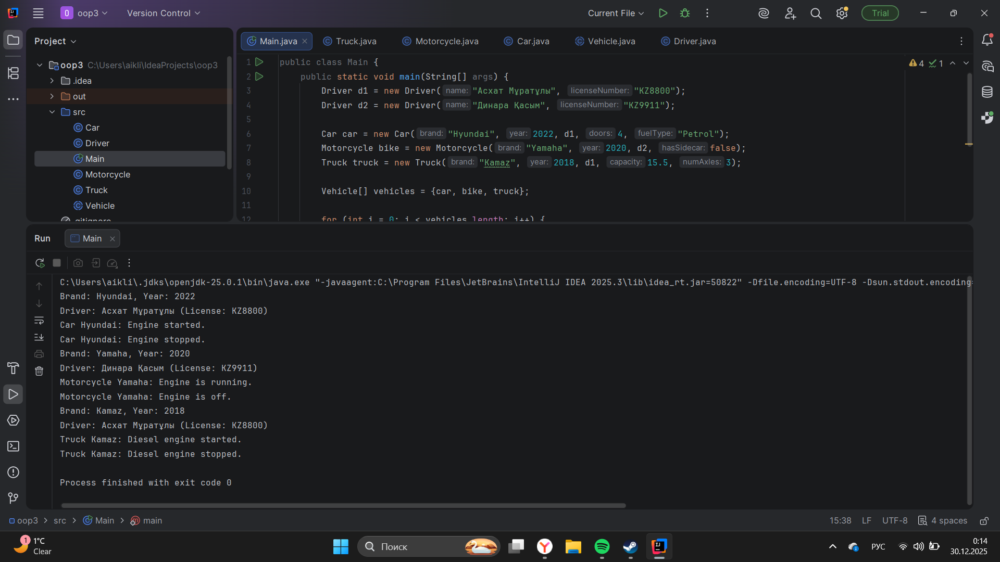

# Vehicle Management System - Assignment 2

## A. Project Overview
This project is a Vehicle Management System developed in Java to demonstrate the core principles of Object-Oriented Programming (OOP), specifically inheritance, abstraction, and object association.

The program models a hierarchy of vehicles wvhere common characteristics are stored in an abstract base class, while specific behaviors are implemented in various subclasses. It also demonstrates how a vehicle can be associated with a specific driver.

## B. Class Hierarchy
The project architecture consists of the following classes:

1. **Vehicle (Abstract Class):** The parent class that defines the general structure. It contains `protected` fields (`brand`, `year`) and abstract methods for engine control.
2. **Subclasses (Car, Motorcycle, Truck):** These classes extend `Vehicle` and provide specific details:
    * `Car` includes the number of doors and fuel type.
    * `Motorcycle` includes a sidecar check.
    * `Truck` includes cargo capacity and number of axles.
3. **Driver:** A separate class that represents the person operating the vehicle. It is linked to the `Vehicle` class through aggregation.

**Key Implementation Details:**
* **Constructor Chaining:** The `super()` keyword is used in all subclasses to pass data to the parent constructor.
* **Polymorphism:** Different vehicle types are stored in a single `Vehicle[]` array and processed using a loop, demonstrating how one interface can handle multiple object types.

## C. Instructions to Compile and Run
To compile and run the project, use the following commands in your terminal:

1. Compile all Java files:
   ```bash
   javac src/*.java

   java -cp src Main

or just paste run

## D. Screenshots


## E. Reflection Section

This assignment really helped me grasp inheritance and abstraction. I realized how useful abstract classes like 'Vehicle' can be—they keep you from repeating code by defining common things like 'brand' and 'year' just once.

I also got the hang of using abstract methods. Making sure each new vehicle type has its own 'startEngine()' and 'stopEngine()' was a big takeaway. Working with an array of objects showed me how polymorphism makes the code more adaptable, so we can handle different vehicles in one go. Lastly, I got some practice with the 'protected' access thing, which lets subclasses use parent fields but keeps them safe from the rest of the program.
