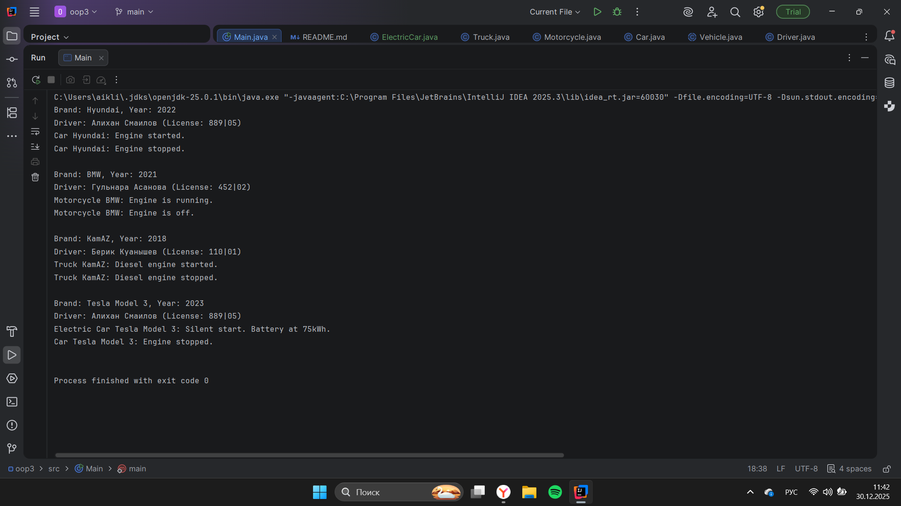

Vehicle Management System - Assignment 2

A. Project Overview
This project is a Vehicle Management System developed in Java to demonstrate the core principles of Object-Oriented Programming (OOP), specifically inheritance, abstraction, and object association.

The program models a hierarchy of vehicles wvhere common characteristics are stored in an abstract base class, while specific behaviors are implemented in various subclasses. It also demonstrates how a vehicle can be associated with a specific driver.

B. Class Hierarchy
The project architecture consists of the following classes:

Vehicle (Abstract Class): The parent class that defines the general structure. It contains `protected` fields (`brand`, `year`) and abstract methods for engine control.
Subclasses (Car, Motorcycle, Truck): These classes extend `Vehicle` and provide specific details:
   `Car` includes the number of doors and fuel type.
`Motorcycle` includes a sidecar check.
`Truck` includes cargo capacity and number of axles.
Driver: A separate class that represents the person operating the vehicle. It is linked to the `Vehicle` class through aggregation.

Key Implementation Details:
Constructor Chaining: The `super()` keyword is used in all subclasses to pass data to the parent constructor.
Polymorphism: Different vehicle types are stored in a single `Vehicle[]` array and processed using a loop, demonstrating how one interface can handle multiple object types.

 C. Instructions to Compile and Run
To compile and run the project, use the following commands in your terminal:

1. Compile all Java files:
   
   javac src/*.java

   java -cp src Main

or just paste run

 D. Screenshots

 E. Reflection Section

Inheritance really helped simplify the design of this project. I put common stuff like brand and year into the Vehicle superclass, which meant I didn't have to repeat code and the system is now easier to keep up-to-date. Now, if I want to add a property to all vehicles, I only have to change it in one spot.

Method overriding let me tweak how each vehicle type acts. Even if the main program sees everything as just a Vehicle in the array, Java knows to call the right version of startEngine() for each vehicle type. The trickiest part was handling access levels. Using protected helped with inheritance, but I needed to watch out not to show too much data and keep everything properly separated.

